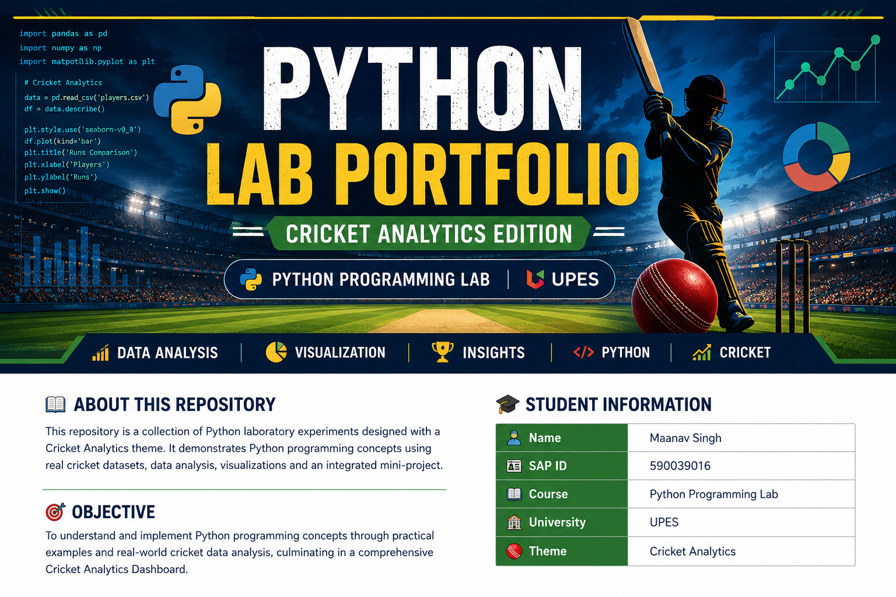

<p align="center">
  
</p>

<h1 align="center">🏏 Python Lab Portfolio</h1>

<p align="center">
  <b>Cricket Analytics Edition</b><br>
  Python Programming Lab • UPES
</p>

---

## 📖 About This Repository

Welcome to my **Python Lab Portfolio**, developed as part of the **Python Programming Lab** course at **UPES**.

This repository creatively presents all Python laboratory experiments through a **Cricket Analytics** theme. Instead of treating each experiment as an isolated program, every notebook contributes toward building a cricket analytics application using real-world datasets, Python programming concepts, and data visualization techniques.

---

## 👨‍🎓 Student Information

| Field | Details |
|-------|---------|
| **Name** | Maanav Singh |
| **SAP ID** | 590039016 |
| **Course** | Python Programming Lab |
| **University** | UPES |
| **Repository Theme** | Cricket Analytics |

---

## 🎯 Assignment Objective

The objective of this repository is to creatively demonstrate Python programming concepts through laboratory experiments, practical implementations, and a cricket analytics mini-project using real datasets.

---

# 📂 Repository Structure

```text
Python-Lab-Portfolio/
│
├── assets/
│   └── banner.png
│
├── datasets/
│   ├── batter_player_stats.csv
│   ├── bowler_player_stats.csv
│   ├── detailed_player_data.csv
│   ├── match_summary.csv
│   ├── players_data_with_all_info.csv
│   └── teams.csv
│
├── images/
│   └── screenshots/
│
├── mini_project/
│   └── Cricket_Analytics_Dashboard.ipynb
│
├── notebooks/
│
├── README.md
├── requirements.txt
└── .gitignore
```

---

# 🧪 Laboratory Experiments

| No. | Experiment | Status |
|:--:|------------------------------------------|:------:|
| 1 | Python Installation & Basics | ⏳ |
| 2 | Input Statements & Operators | ⏳ |
| 3 | Conditional Statements | ⏳ |
| 4 | Loops | ⏳ |
| 5 | Strings & Sets | ⏳ |
| 6 | Lists, Tuples & Dictionaries | ⏳ |
| 7 | Functions | ⏳ |
| 8 | File Handling & Exception Handling | ⏳ |
| 9 | Classes & Objects | ⏳ |
| 10 | Data Analysis & Visualization | ⏳ |

> **Legend:** ⏳ In Progress &nbsp;&nbsp; ✅ Completed

---

# 📊 Datasets

The repository uses real cricket datasets to implement Python concepts and perform data analysis.

| Dataset | Description |
|---------|-------------|
| `players_data_with_all_info.csv` | Complete player profiles and career information |
| `teams.csv` | International cricket team information |
| `batter_player_stats.csv` | Batting statistics of players |
| `bowler_player_stats.csv` | Bowling statistics of players |
| `detailed_player_data.csv` | Detailed player performance records |
| `match_summary.csv` | Match summaries and results |

---

# 🏆 Mini Project

## Cricket Analytics Dashboard

The final mini-project combines concepts learned throughout the laboratory into a single cricket analytics application.

### Key Features

- 📊 Player Statistics
- 🏏 Team Comparison
- 📈 Match Analysis
- 📉 Data Visualization
- 📂 CSV File Handling
- ⚠️ Exception Handling
- 🧩 Object-Oriented Programming
- 🔍 Player Search & Filtering

---

# 🛠️ Technologies Used

- Python
- Jupyter Notebook
- Pandas
- NumPy
- Matplotlib
- Git
- GitHub

---

# 🤖 Use of AI Tools

This project was developed with assistance from AI tools such as **ChatGPT** for:

- Understanding Python concepts
- Debugging programs
- Improving notebook explanations
- Designing the repository structure
- Suggesting creative project ideas
- Enhancing documentation and presentation

All AI-generated content was reviewed, tested, modified where necessary, and fully understood before inclusion in this repository.

---

# 🚀 Future Enhancements

- Interactive Cricket Analytics Dashboard
- Advanced Player Performance Analysis
- Additional Visualizations
- Team Comparison Dashboard
- Expanded Cricket Datasets

---

# 📜 Academic Declaration

This repository has been developed solely for academic purposes as part of the **Python Programming Lab** course at **UPES**.

All code has been executed successfully, and every notebook will include visible outputs, explanations, and creative extensions as required by the assignment.

---

<p align="center">

### ⭐ Thank you for visiting this repository! ⭐

</p>
